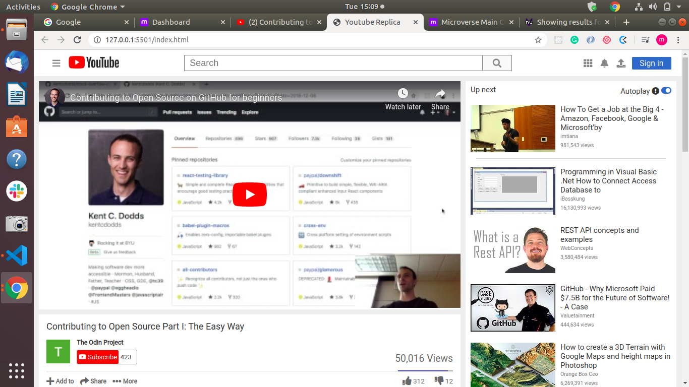

# Embedding Images and Video Project

> Youtube replica

The page tries to replicate as much as possible the actual YouTube page.

## Built With

- Html,
- CSS

## Live Demo

[Live Demo Link](https://rawcdn.githack.com/adamclasic/Youtube-clone/5dbd2d504023e3b4611ebb46c26fba9fff72863c/index.html)

## Authors

👤 **Author1**

- Github: [@adamclasic](https://github.com/adamclasic)

👤 **Author2**

- Github: [@Mupa1](https://github.com/Mupa1)
- Linkedin: [@mupa-nzaphila](www.linkedin.com/in/mupa-nzaphila)

## 🤝 Contributing

Contributions, issues and feature requests are welcome! Start by:
* Forking the project
* Cloning the project to your local machine
* `cd` into the Youtube-Replica project directory
* Run `git checkout -b your-branch-name`
* Make your contributions
* Push your branch up to your forked repository
* Open a Pull Request with a detailed description to the development branch of the original project for a review

## 📝 License

This project is [MIT](https://opensource.org/licenses/MIT) licensed.

